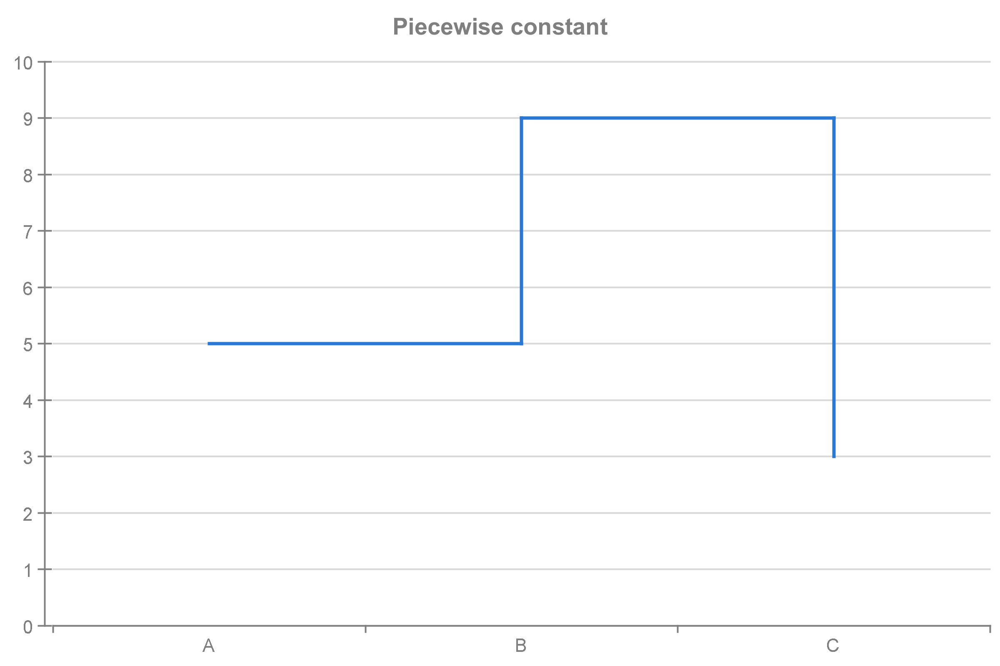
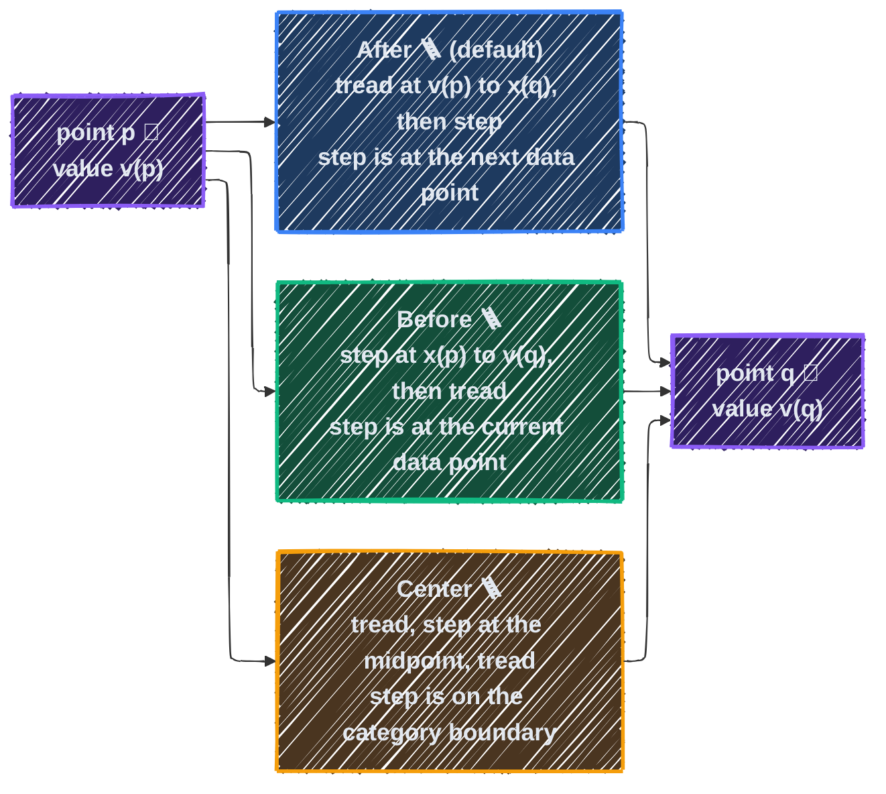

<div align="center">

# [deprecated] ~~birt-piecewise-constant~~
**~~Piecewise constant series for the Eclipse BIRT chart engine~~**

📈 ~~[Features](#features)~~ | 🚅 ~~[Quick Start](#quick-start)~~ | 📗 ~~[Usage](#usage)~~ | 🤝 ~~[Contributing](./CONTRIBUTING.md)~~

![BIRT](https://img.shields.io/badge/BIRT-4.24-2C2255.svg?logo=data:image/svg+xml;base64,PHN2ZyBmaWxsPSIjZmZmZmZmIiB2ZXJzaW9uPSIxLjEiIGlkPSJMYXllcl8xIiB4bWxucz0iaHR0cDovL3d3dy53My5vcmcvMjAwMC9zdmciIHhtbG5zOnhsaW5rPSJodHRwOi8vd3d3LnczLm9yZy8xOTk5L3hsaW5rIiB2aWV3Qm94PSIwIDAgOTIgOTIiIGVuYWJsZS1iYWNrZ3JvdW5kPSJuZXcgMCAwIDkyIDkyIiB4bWw6c3BhY2U9InByZXNlcnZlIj48ZyBpZD0iU1ZHUmVwb19iZ0NhcnJpZXIiIHN0cm9rZS13aWR0aD0iMCI+PC9nPjxnIGlkPSJTVkdSZXBvX3RyYWNlckNhcnJpZXIiIHN0cm9rZS1saW5lY2FwPSJyb3VuZCIgc3Ryb2tlLWxpbmVqb2luPSJyb3VuZCI+PC9nPjxnIGlkPSJTVkdSZXBvX2ljb25DYXJyaWVyIj4gPHBhdGggaWQ9IlhNTElEXzExNTdfIiBkPSJNNiw4MmMtMC45LDAtMS44LTAuMi0yLjYtMC43Yy0yLjQtMS40LTMuMS00LjUtMS43LTYuOUwxMy45LDU0YzAuOS0xLjQsMi40LTIuNCw0LjEtMi40IGMxLjctMC4xLDMuMywwLjcsNC4zLDIuMWw1LjIsNy4ybDExLTE4LjhjMC44LTEuNCwyLjQtMi40LDQtMi41YzEuNy0wLjEsMy4zLDAuNyw0LjMsMmw5LjYsMTIuOWwyNS4zLTQyYzEuNC0yLjQsNC41LTMuMSw2LjktMS43IGMyLjQsMS40LDMuMSw0LjUsMS43LDYuOUw2MS4yLDY2Yy0wLjksMS40LTIuNCwyLjMtNCwyLjRjLTEuNywwLjEtMy4zLTAuNy00LjMtMmwtOS42LTEyLjhMMzIuMiw3Mi40Yy0wLjksMS41LTIuNCwyLjQtNC4xLDIuNSBjLTEuNywwLjEtMy4zLTAuNy00LjMtMi4xbC01LjItNy4ybC04LjMsMTMuOUM5LjQsODEuMSw3LjcsODIsNiw4MnoiPjwvcGF0aD4gPC9nPjwvc3ZnPg==)
![Java](https://img.shields.io/badge/Java-21%2B-F89820.svg?logo=data:image/svg+xml;base64,PHN2ZyBoZWlnaHQ9IjEzMnB4IiB3aWR0aD0iMTMycHgiIHZlcnNpb249IjEuMSIgaWQ9IkNhcGFfMSIgeG1sbnM9Imh0dHA6Ly93d3cudzMub3JnLzIwMDAvc3ZnIiB4bWxuczp4bGluaz0iaHR0cDovL3d3dy53My5vcmcvMTk5OS94bGluayIgdmlld0JveD0iMCAwIDUwMi42MzIgNTAyLjYzMiIgeG1sOnNwYWNlPSJwcmVzZXJ2ZSIgZmlsbD0iI2ZmZmZmZiIgc3Ryb2tlPSIjZmZmZmZmIiBzdHJva2Utd2lkdGg9IjcuNTM5NDgiPjxnIGlkPSJTVkdSZXBvX2JnQ2FycmllciIgc3Ryb2tlLXdpZHRoPSIwIj48L2c+PGcgaWQ9IlNWR1JlcG9fdHJhY2VyQ2FycmllciIgc3Ryb2tlLWxpbmVjYXA9InJvdW5kIiBzdHJva2UtbGluZWpvaW49InJvdW5kIj48L2c+PGcgaWQ9IlNWR1JlcG9faWNvbkNhcnJpZXIiPiA8Zz4gPGc+IDxwYXRoIHN0eWxlPSJmaWxsOiNmZmZmZmY7IiBkPSJNMjQwLjg2NCwyNjkuODk0YzAsMC0yOC4wMi01My45OTItMjYuOTg1LTkzLjQ0NWMwLjc1NS0yOC4xOTMsNjQuMzI0LTU2LjA2Miw4OS4yODEtOTYuNTI5IEMzMjguMDc0LDM5LjQzMSwzMDAuMDU0LDAsMzAwLjA1NCwwczYuMjM0LDI5LjA3Ny0xMC4zNzYsNTkuMTQ3Yy0xNi42MDksMzAuMTEzLTc3LjkxNCw0Ny43NzktMTAxLjc0OSw5OS42NzkgUzI0MC44NjQsMjY5Ljg5NCwyNDAuODY0LDI2OS44OTR6Ij48L3BhdGg+IDxwYXRoIHN0eWxlPSJmaWxsOiNmZmZmZmY7IiBkPSJNMzQ1Ljc0MSwxMDUuODY5YzAsMC05NS40OTQsMzYuMzQ3LTk1LjQ5NCw3Ny44NDljMCw0MS41NDUsMjUuOTI4LDU1LjAyNywzMC4xMTMsNjguNTA5IGM0LjE0MiwxMy41MjUtNy4yNjksMzYuMzQ3LTcuMjY5LDM2LjM0N3MzNy4zNjEtMjUuOTUsMzEuMTA1LTU2LjA2MmMtNi4yMzQtMzAuMTEzLTM1LjI5LTM5LjQ3NS0xOC42NTktNjkuNTQ0IEMyOTYuNjQ2LDE0Mi43OTksMzQ1Ljc0MSwxMDUuODY5LDM0NS43NDEsMTA1Ljg2OXoiPjwvcGF0aD4gPHBhdGggc3R5bGU9ImZpbGw6I2ZmZmZmZjsiIGQ9Ik0yMzAuNTEsMzI0Ljc0OGM4OC4yNDYtMy4xNDksMTIwLjQzLTMwLjk5NywxMjAuNDMtMzAuOTk3IGMtNTcuMDc2LDE1LjU1My0yMDguNjU0LDE0LjUzOS0yMDkuNzExLDMuMTI4Yy0xLjAxNC0xMS40MTEsNDYuNzAxLTIwLjc3Myw0Ni43MDEtMjAuNzczcy03NC43MjEsMC04MC45NTUsMTguNjggQzEwMC43NCwzMTMuNDY3LDE0Mi4zMjgsMzI3LjgzMywyMzAuNTEsMzI0Ljc0OHoiPjwvcGF0aD4gPHBhdGggc3R5bGU9ImZpbGw6I2ZmZmZmZjsiIGQ9Ik0zNTguMTg3LDM2OC40OTRjMCwwLDg2LjM2OS0xOC40MjEsNzcuODI3LTY1LjMzOGMtMTAuMzU0LTU3LjExOS03MC41OC0yNC45MzYtNzAuNTgtMjQuOTM2IHM0Mi42MDIsMCw0Ni43MjIsMjUuOTI4QzQxNi4zMiwzMzAuMDk4LDM1OC4xODcsMzY4LjQ5NCwzNTguMTg3LDM2OC40OTR6Ij48L3BhdGg+IDxwYXRoIHN0eWxlPSJmaWxsOiNmZmZmZmY7IiBkPSJNMzE1LjYyOCwzNDMuNjAxYzAsMC0yMS43NjUsNS43MTYtNTQuMDEzLDkuMzRjLTQzLjIyOCw0Ljg1My05NS40OTQsMS4wMTQtOTkuNjU3LTYuMjU2IGMtNC4wOTgtNy4yNjksNy4yNjktMTEuNDExLDcuMjY5LTExLjQxMWMtNTEuOTIxLDEyLjQ2OC0yMy41MTIsMzQuMjMzLDM3LjMzOSwzOC40MThjNTIuMTU4LDMuNTU5LDEyOS43OTEtMTUuNTc0LDEyOS43OTEtMTUuNTc0IEwzMTUuNjI4LDM0My42MDF6Ij48L3BhdGg+IDxwYXRoIHN0eWxlPSJmaWxsOiNmZmZmZmY7IiBkPSJNMTgxLjczOCwzODguOTQzYzAsMC0yMy41NTUsMC42NjktMjQuOTM2LDEzLjEzN2MtMS4zNTksMTIuMzgyLDE0LjQ5NiwyMy41MTIsNzIuNjUsMjYuOTY0IGM1OC4xMzMsMy40NTEsOTguOTg4LTE1Ljg5OCw5OC45ODgtMTUuODk4bC0yNi4yOTUtMTUuOTYyYzAsMC0xNi42MzEsMy40OTQtNDIuMjM2LDYuOTQ2IGMtMjUuNjI2LDMuNDczLTc4LjE3My0yLjc4My04MC4yNDMtNy41OTNDMTc3LjU1MywzOTEuNjgyLDE4MS43MzgsMzg4Ljk0MywxODEuNzM4LDM4OC45NDN6Ij48L3BhdGg+IDxwYXRoIHN0eWxlPSJmaWxsOiNmZmZmZmY7IiBkPSJNNDA3Ljk5NCw0NDUuMDA1YzguOTk1LTkuNzA3LTIuNzgzLTE3LjMyMS0yLjc4My0xNy4zMjFzNC4xNDIsNC44NTMtMS4zMzcsMTAuMzc2IGMtNS41NDQsNS41MjItNTYuMDg0LDE5LjM0OS0xMzcuMDYxLDIzLjUxMmMtODAuOTU1LDQuMTYzLTE2OC44NTYtNy42MTUtMTcxLjYzOS0xNy45OSBjLTIuNjk2LTEwLjM3Niw0NS4wMTgtMTguNjU5LDQ1LjAxOC0xOC42NTljLTUuNTIyLDAuNjktNzEuOTYsMi4wNzEtNzQuMDc0LDIwLjA4MmMtMi4wNzEsMTcuOTY4LDI5LjA1NiwzMi41MDcsMTUzLjY3LDMyLjUwNyBDMzQ0LjMzOSw0NzcuNDkxLDM5OS4wNDIsNDU0LjY0Nyw0MDcuOTk0LDQ0NS4wMDV6Ij48L3BhdGg+IDxwYXRoIHN0eWxlPSJmaWxsOiNmZmZmZmY7IiBkPSJNMzU5LjU2OCw0ODUuODE3Yy01NC42ODIsMTEuMDQ0LTIyMC43MzQsNC4wNzctMjIwLjczNCw0LjA3N3MxMDcuOTE5LDI1LjYyNiwyMzEuMTA5LDQuMTg1IGM1OC44ODgtMTAuMjY4LDYyLjMxOC0zOC43NjMsNjIuMzE4LTM4Ljc2M1M0MTQuMjUsNDc0LjcwOCwzNTkuNTY4LDQ4NS44MTd6Ij48L3BhdGg+IDwvZz4gPGc+IDwvZz4gPGc+IDwvZz4gPGc+IDwvZz4gPGc+IDwvZz4gPGc+IDwvZz4gPGc+IDwvZz4gPGc+IDwvZz4gPGc+IDwvZz4gPGc+IDwvZz4gPGc+IDwvZz4gPGc+IDwvZz4gPGc+IDwvZz4gPGc+IDwvZz4gPGc+IDwvZz4gPGc+IDwvZz4gPC9nPiA8L2c+PC9zdmc+)


![License](https://img.shields.io/badge/License-EPL--2.0-475569.svg?logo=data:image/svg+xml;base64,PHN2ZyBmaWxsPSIjZmZmZmZmIiB3aWR0aD0iMTY0cHgiIGhlaWdodD0iMTY0cHgiIHZpZXdCb3g9IjAgMCA1MTIuMDAgNTEyLjAwIiB4bWxucz0iaHR0cDovL3d3dy53My5vcmcvMjAwMC9zdmciIHN0cm9rZT0iI2ZmZmZmZiIgc3Ryb2tlLXdpZHRoPSIwLjAwNTEyIj48ZyBpZD0iU1ZHUmVwb19iZ0NhcnJpZXIiIHN0cm9rZS13aWR0aD0iMCI+PC9nPjxnIGlkPSJTVkdSZXBvX3RyYWNlckNhcnJpZXIiIHN0cm9rZS1saW5lY2FwPSJyb3VuZCIgc3Ryb2tlLWxpbmVqb2luPSJyb3VuZCIgc3Ryb2tlPSIjQ0NDQ0NDIiBzdHJva2Utd2lkdGg9IjMuMDcyIj48L2c+PGcgaWQ9IlNWR1JlcG9faWNvbkNhcnJpZXIiPjxwYXRoIGQ9Ik0yNTYgOEMxMTkuMDMzIDggOCAxMTkuMDMzIDggMjU2czExMS4wMzMgMjQ4IDI0OCAyNDggMjQ4LTExMS4wMzMgMjQ4LTI0OFMzOTIuOTY3IDggMjU2IDh6bTExNy4xMzQgMzQ2Ljc1M2MtMS41OTIgMS44NjctMzkuNzc2IDQ1LjczMS0xMDkuODUxIDQ1LjczMS04NC42OTIgMC0xNDQuNDg0LTYzLjI2LTE0NC40ODQtMTQ1LjU2NyAwLTgxLjMwMyA2Mi4wMDQtMTQzLjQwMSAxNDMuNzYyLTE0My40MDEgNjYuOTU3IDAgMTAxLjk2NSAzNy4zMTUgMTAzLjQyMiAzOC45MDRhMTIgMTIgMCAwIDEgMS4yMzggMTQuNjIzbC0yMi4zOCAzNC42NTVjLTQuMDQ5IDYuMjY3LTEyLjc3NCA3LjM1MS0xOC4yMzQgMi4yOTUtLjIzMy0uMjE0LTI2LjUyOS0yMy44OC02MS44OC0yMy44OC00Ni4xMTYgMC03My45MTYgMzMuNTc1LTczLjkxNiA3Ni4wODIgMCAzOS42MDIgMjUuNTE0IDc5LjY5MiA3NC4yNzcgNzkuNjkyIDM4LjY5NyAwIDY1LjI4LTI4LjMzOCA2NS41NDQtMjguNjI1IDUuMTMyLTUuNTY1IDE0LjA1OS01LjAzMyAxOC41MDggMS4wNTNsMjQuNTQ3IDMzLjU3MmExMi4wMDEgMTIuMDAxIDAgMCAxLS41NTMgMTQuODY2eiI+PC9wYXRoPjwvZz48L3N2Zz4=)
<br/>
[](https://github.com/lextpf/birt-piecewise-constant/actions/workflows/build.yml)
[](https://github.com/lextpf/birt-piecewise-constant/actions/workflows/test.yml)
<br/>
![Sponsor](https://img.shields.io/static/v1?label=sponsor&message=%E2%9D%A4&color=ff69b4&logo=data:image/svg+xml;base64,PHN2ZyB4bWxucz0iaHR0cDovL3d3dy53My5vcmcvMjAwMC9zdmciIHZpZXdCb3g9IjAgMCA2NDAgNjQwIj48IS0tIUZvbnQgQXdlc29tZSBQcm8gdjcuMi4wIGJ5IEBmb250YXdlc29tZSAtIGh0dHBzOi8vZm9udGF3ZXNvbWUuY29tIExpY2Vuc2UgLSBodHRwczovL2ZvbnRhd2Vzb21lLmNvbS9saWNlbnNlIChDb21tZXJjaWFsIExpY2Vuc2UpIENvcHlyaWdodCAyMDI2IEZvbnRpY29ucywgSW5jLi0tPjxwYXRoIG9wYWNpdHk9IjEiIGZpbGw9IiNmZjY5YjRmZiIgZD0iTTMyIDQ4MEwzMiA1NDRDMzIgNTYxLjcgNDYuMyA1NzYgNjQgNTc2TDM4NC41IDU3NkM0MTMuNSA1NzYgNDQxLjggNTY2LjcgNDY1LjIgNTQ5LjVMNTkxLjggNDU2LjJDNjA5LjYgNDQzLjEgNjEzLjQgNDE4LjEgNjAwLjMgNDAwLjNDNTg3LjIgMzgyLjUgNTYyLjIgMzc4LjcgNTQ0LjQgMzkxLjhMNDI0LjYgNDgwTDMxMiA0ODBDMjk4LjcgNDgwIDI4OCA0NjkuMyAyODggNDU2QzI4OCA0NDIuNyAyOTguNyA0MzIgMzEyIDQzMkwzODQgNDMyQzQwMS43IDQzMiA0MTYgNDE3LjcgNDE2IDQwMEM0MTYgMzgyLjMgNDAxLjcgMzY4IDM4NCAzNjhMMjMxLjggMzY4QzE5Ny45IDM2OCAxNjUuMyAzODEuNSAxNDEuMyA0MDUuNUw5OC43IDQ0OEw2NCA0NDhDNDYuMyA0NDggMzIgNDYyLjMgMzIgNDgweiIvPjxwYXRoIGZpbGw9InJnYmEoMjU1LCAyNTUsIDI1NSwgMS4wMCkiIGQ9Ik0yNTAuOSA2NEMyNzQuOSA2NCAyOTcuNSA3NS41IDMxMS42IDk1TDMyMCAxMDYuN0wzMjguNCA5NUMzNDIuNSA3NS41IDM2NS4xIDY0IDM4OS4xIDY0QzQzMC41IDY0IDQ2NCA5Ny41IDQ2NCAxMzguOUw0NjQgMTQxLjNDNDY0IDIwNS43IDM4MiAyNzQuNyAzNDEuOCAzMDQuNkMzMjguOCAzMTQuMyAzMTEuMyAzMTQuMyAyOTguMyAzMDQuNkMyNTguMSAyNzQuNiAxNzYgMjA1LjcgMTc2LjEgMTQxLjNMMTc2LjEgMTM4LjlDMTc2IDk3LjUgMjA5LjUgNjQgMjUwLjkgNjR6Ii8+PC9zdmc+)
</div>

~~A chart-engine plug-in for *Eclipse BIRT* that adds a **PiecewiseConstantSeries**. The renderer holds the value of every data point until the next one, so the line becomes a run of **treads** and **steps**. Three **step modes** decide where the vertical step falls: *After*, *Before*, or *Center*. The series is a subclass of BIRT's *LineSeries*, so **markers**, **data point labels**, **stacking**, **transposed charts** and the **legend** keep their stock behaviour. It ships as one *OSGi bundle* jar.~~

<div align="center">
<br>



</div>

> [!IMPORTANT]
> **This plug-in is a stop-gap.**
>
> - The same feature is proposed upstream in [eclipse-birt PR #2480](https://github.com/eclipse-birt/birt/pull/2480), which fixes [issue #2478](https://github.com/eclipse-birt/birt/issues/2478). When that pull request merges, the BIRT chart engine carries the series itself and this plug-in is deprecated.
> - The chart wizard of the BIRT Designer has no page for this series. Create the chart with the Java API, or edit the chart XML in the `.rptdesign` file.

```
/* ============================================================================================== *
 *                                                    ⠀⣰⣄⡀⠀⠀⠀⠀⠀⠀⠀⠀⠀⠀⠀⠀⠀⠀⠀⠀⠀⠀⠀⠀⠀⠀⠀⠀⠀⠀⠀⣀⣴⡾
 *                                                    ⠀⣿⡍⠛⠲⣶⣄⣀⡀⠀⠀⠀⠀⠀⠀⠀⠀⠀⠀⠀⠀⠀⠀⠀⣀⣠⡴⠞⠉⣠⡞⠀⠀
 *     :::::::::  ::::::::::: :::::::::  :::::::::::  ⠀⠘⣽⢷⣦⣌⣈⠋⡚⠿⣦⡀⠀⠀⣀⣤⠀⠀⠀⣠⡶⠚⠛⣙⣭⠠⣤⣶⣯⠆⠀⠀⠀
 *     :+:    :+:     :+:     :+:    :+:     :+:      ⠀⠀⣼⣷⣀⠀⠀⠈⠀⠀⠀⢻⡇⠺⡿⠛⣿⠀⠀⢿⠀⠀⣼⠿⣫⣭⣠⣤⡶⠂⠀⠀⠀
 *     +:+    +:+     +:+     +:+    +:+     +:+      ⠀⠀⠀⠉⠛⠿⣹⣾⠔⠃⠀⠈⠳⠾⠏⠀⠻⣶⡺⠋⠀⣤⣸⣷⣶⡾⠖⠀⠀⠀⠀⠀⠀
 *     +#++:++#+      +#+     +#++:++#:      +#+      ⠀⠀⠀⠀⠈⠒⠷⣿⡻⣞⣀⣄⣀⣀⡄⠀⠀⣠⣄⣸⡿⣾⣿⡽⡄⠀⠀⠀⠀⠀⠀⠀⠀
 *     +#+    +#+     +#+     +#+    +#+     +#+      ⠀⠀⠀⠀⠀⠀⠀⠀⠛⠟⠯⣽⢿⡿⠃⠀⢀⣿⡙⠑⠙⠛⠉⠁⠀⠀⠀⠀⠀⠀⠀⠀⠀
 *     #+#    #+#     #+#     #+#    #+#     #+#        ⠀⠀⠀⠀⠀⠀⠀⠀⠀⠀⠀⢰⣯⣦⣾⣿⠃⠀⠀⠀⠀⠀⠀⠀⠀⠀⠀⠀⠀⠀⠀
 *     #########  ########### ###    ###     ###      ⠀⠀⠀⠀⠀⠀⠀⠀⠀⠀⠀⠀⠀⢸⣼⣿⣿⣿⠀⠀⠀⠀⠀⠀⠀⠀⠀⠀⠀⠀⠀⠀⠀
 *                                                    ⠀⠀⠀⠀⠀⠀⠀⠀⠀⠀⠀⠀⠀⠈⣿⢩⡿⠘⠀⠀⠀⠀⠀⠀⠀⠀⠀⠀⠀⠀⠀⠀⠀
 *                                                    ⠀⠀⠀⠀⠀⠀⠀⠀⠀⠀⠀⠀⠀⠀⠈⣽⡃⠀⠀⠀⠀⠀⠀⠀⠀⠀⠀⠀⠀⠀⠀⠀⠀
 *                           << P I E C E W I S E   C O N S T A N T >>
 *
 * ============================================================================================== */
```

```
birt-piecewise-constant/                     # BIRT 4.24 chart-engine plug-in (Java 21, EPL-2.0)
|-- src/                                     # Plug-in source; package io.github.lextpf.birt.chart.*
|   |-- PiecewiseConstantSetup               # registerStandalone() for the standalone chart engine
|   |-- model/                               # Namespace to EPackage bridge, and the EMF model
|   |   |-- PiecewiseConstantModelLoader     # IExtChartModelLoader behind the charttypes point
|   |   +-- type/                            # EMF model: the series interface and StepMode
|   |       |-- PiecewiseConstantSeries      # EMF interface; LineSeries subclass with StepMode
|   |       |-- StepMode                     # After / Before / Center EMF Enumerator
|   |       |-- PiecewiseConstantPackage     # EPackage: classifiers, features, literals
|   |       |-- PiecewiseConstantFactory     # EMF factory interface
|   |       +-- impl/                        # Hand-written EMF impls; create/createDefault
|   +-- render/                              # Drawing path over the stock BIRT Line renderer
|       |-- PiecewiseConstantLine            # Model renderer; adds corner vertices, then delegates
|       |-- PiecewiseConstantExpander        # Expands data points into tread and step vertices
|       +-- PiecewiseConstantExpansion       # Value object that holds the expanded vertices
|-- test/                                    # JUnit 5 suite; mirrors the src package layout
|   |-- model/                               # Plug-in discovery and serializer round-trip tests
|   |-- render/                              # Expander, geometry and render smoke tests
|   |-- test/                                # Fixtures, capturing PNG renderer, platform extension
|   |-- RuntimeSmokeIT                       # End-to-end run on a real birt-runtime distribution
|   |-- SampleReportTest                     # Runs piecewise-constant-sample.rptdesign
|   |-- StandaloneFallbackTest               # registerStandalone() under PROP_STANDALONE
|   +-- piecewise-constant-sample.rptdesign  # Runnable report with a scripted five-row data set
|-- model/piecewise-constant.ecore           # EMF source of the type package
|-- META-INF/MANIFEST.MF                     # OSGi bundle; Require-Bundle chart.engine [4.24,5.0)
|-- plugin.xml                               # modelrenderers, datasetprocessors, charttypes
|-- about.html                               # Eclipse about file shipped inside the bundle
|-- build.properties                         # PDE bin.includes for the bundle contents
|-- pom.xml                                  # Maven build; writes the OSGi-shaped jar to build/
|-- setup.ps1                                # Writes the git-ignored .env with the tool paths
|-- toolchain.ps1                            # Shared tool resolution for the PowerShell scripts
|-- build.ps1                                # Builds the jar; build.ps1 install fills ~/.m2
|-- test.ps1                                 # Runs the test suite and prints the results
|-- .github/workflows/build.yml              # Reusable workflow: compile and package the jar
|-- .github/workflows/test.yml               # Reusable workflow: the JUnit 5 suite
|-- .github/workflows/release.yml            # Tag trigger; calls build and test, then publishes
|-- .github/release-notes/                   # Per-tag release note bodies
|-- .github/dependabot.yml                   # GitHub Actions version bumps
|-- CONTRIBUTING.md                          # Contribution standards for humans and AI agents
|-- LICENSE.md                               # Eclipse Public License 2.0
|-- PREVIEW.png                              # The image at the top of this file
+-- README.md                                # Project overview (this file)
```

## Features

### Step modes

A piecewise constant line holds the value of a data point until the next data point. The **step mode** decides where the vertical step between two values falls. `After` is the default.

| Step mode | Where the renderer draws the step | Shape between point *p* and point *q* |
| --- | --- | --- |
| `After` | at the next data point | tread at the value of *p* up to the position of *q*, then step |
| `Before` | at the current data point | step at the position of *p* to the value of *q*, then tread |
| `Center` | at the midpoint between the two data points | tread, step at the midpoint, tread |



### Behaviour

- 📏 **Category axis** - the treads run from category centre to category centre. A `Center` step falls on the category boundary.
- 🕳️ **Missing values** - with `connectMissingValue = true` (the default) the line steps across the gap. With `false` the run breaks, and BIRT draws the isolated points as markers.
- ➖ **Equal neighbours** - two equal values form one tread and produce no corner.
- 🚫 **Curve ignored** - the renderer ignores `curve = true`. A piecewise constant line has no spline, so `renderAsCurve` takes the same path as `renderDataPoints`.
- 📍 **Markers, labels and tooltips** - stay on the real data points. Each corner vertex reuses the `DataPointHints` of the point whose value it carries, so the tooltip of a tread belongs to that point.

### What stays a LineSeries

- 🧱 **Stacking** - unchanged; the series inherits it from `LineSeries`.
- 🔄 **Transposed charts** - unchanged; the renderer maps the device coordinates to the category axis and the value axis before the expansion, so a transposed chart steps the same way.
- 🏷️ **Legend** - the legend graphic is the stock `Line` one; the renderer does not override it.
- ⭐ **Markers and the shadow** - the markers come from the original arrays, so they stay on the data points; the shadow is expanded like the line, so it follows the treads and steps.

## Technology Stack

| Component    | Technology                       |
|--------------|----------------------------------|
| Language     | Java 21                          |
| Chart engine | Eclipse BIRT 4.24                |
| Model        | EMF 2.43                         |
| Packaging    | OSGi bundle jar                  |
| Build        | Maven 3.9 + PowerShell 7 scripts |
| Testing      | JUnit 5                          |
| License      | EPL-2.0                          |

## Quick Start

### Prerequisites

- **PowerShell 7** - the scripts declare `#Requires -Version 7.0`. On another platform, call Maven directly.
- **JDK 21 or newer** - the bundle declares `JavaSE-21`, and the compiler targets release 21.
- **Apache Maven 3.9** - the build is a single Maven module that writes the jar to `build/`.
- **An unpacked `birt-runtime-4.24.0`** (optional) - pass it to `setup.ps1` to enable `RuntimeSmokeIT`. The script never guesses this path.

```powershell
# 1. Clone the repository
git clone https://github.com/lextpf/birt-piecewise-constant.git
cd birt-piecewise-constant

# 2. Write the git-ignored .env with the tool paths
.\setup.ps1

# 3. Build the jar; this step runs no test
.\build.ps1

# 4. Run the test suite and print the results
.\test.ps1
```

Output: `build/io.github.lextpf.birt.chart.piecewiseconstant_1.0.0.jar`

**Download** [The latest release](https://github.com/lextpf/birt-piecewise-constant/releases/latest) of `io.github.lextpf.birt.chart.piecewiseconstant_1.0.0.jar`. The jar carries `plugin.xml` and an OSGi `META-INF/MANIFEST.MF` at its root.

## Installation

Put the jar where the class loader or the plug-in loader of the engine finds it. The plug-in needs no configuration, and an installed jar needs no registration call: its three extension points (`modelrenderers`, `datasetprocessors`, `charttypes`) register the renderer, the data set processor and the model loader.

| Engine type | Where the jar goes |
| --- | --- |
| POJO runtime: the `birt-runtime` distribution, `ReportRunner`, `Platform.startup`, a servlet with the engine on its classpath | `ReportEngine/lib/`, or another classpath entry |
| BIRT Viewer, `birt.war` | `WEB-INF/lib/` |
| OSGi runtime, or any application that sets `BIRT_HOME` | `<BIRT_HOME>/platform/plugins/` |
| Eclipse BIRT Designer (it renders and previews) | `<eclipse>/dropins/plugins/`, then restart with `-clean` |

> [!WARNING]
> If you use the POJO runtime, then do not set `BIRT_HOME`. A set `BIRT_HOME` starts Equinox.

### Requirements

- **Java 21 or newer** - the bundle declares `Bundle-RequiredExecutionEnvironment: JavaSE-21`.
- **BIRT 4.24 up to (not including) 5.0** under the OSGi runtime - `Require-Bundle: org.eclipse.birt.chart.engine;bundle-version="[4.24.0,5.0.0)"`.
- On a **POJO classpath there is no version check**. The build compiled the jar against BIRT 4.24.0.

## Usage

### In a `.rptdesign`

The report holds the chart as the `xmlRepresentation` CDATA of an `<extended-item extensionName="Chart">`. Three edits turn a line chart into a step chart:

1. Add `xmlns:piecewise="http://lextpf.github.io/birt/chart/PiecewiseConstantModelType"` to the `<model:ChartWithAxes ...>` root element.
2. Change the value series from `xsi:type="type:LineSeries"` to `xsi:type="piecewise:PiecewiseConstantSeries"`.
3. Optionally add the child element `<StepMode>`. It is an element and not an attribute. Its only legal values are `After`, `Before` and `Center`. An absent element means `After`. A different value, for example `Centre`, stops the chart XML from loading.

```xml
<model:ChartWithAxes xmlns:xsi="http://www.w3.org/2001/XMLSchema-instance"
                     xmlns:model="http://www.birt.eclipse.org/ChartModel"
                     xmlns:piecewise="http://lextpf.github.io/birt/chart/PiecewiseConstantModelType" ...>
  ...
        <Series xsi:type="piecewise:PiecewiseConstantSeries">
          ...
          <StepMode>After</StepMode>
        </Series>
  ...
</model:ChartWithAxes>
```

[`test/piecewise-constant-sample.rptdesign`](test/piecewise-constant-sample.rptdesign) is a runnable example with a scripted five-row data set (`category`, `value`). The engine that runs the report must have [the plug-in installed](#installation).

### With the Java API

```java
import org.eclipse.birt.chart.model.ChartWithAxes;
import org.eclipse.birt.chart.model.data.SeriesDefinition;
import org.eclipse.birt.chart.model.data.impl.NumberDataSetImpl;
import org.eclipse.birt.chart.model.data.impl.SeriesDefinitionImpl;
import io.github.lextpf.birt.chart.piecewiseconstant.PiecewiseConstantSetup;
import io.github.lextpf.birt.chart.piecewiseconstant.model.type.PiecewiseConstantSeries;
import io.github.lextpf.birt.chart.piecewiseconstant.model.type.StepMode;
import io.github.lextpf.birt.chart.piecewiseconstant.model.type.impl.PiecewiseConstantSeriesImpl;

// Only for the STANDALONE chart engine - see below.
PiecewiseConstantSetup.registerStandalone();

PiecewiseConstantSeries series = (PiecewiseConstantSeries) PiecewiseConstantSeriesImpl.create();
series.setStepMode(StepMode.CENTER_LITERAL);
series.setDataSet(NumberDataSetImpl.create(new Double[] { 12.5, 19.6, 18.3, 13.2, 26.5 }));
SeriesDefinition valueDefinition = SeriesDefinitionImpl.create();
chart.getPrimaryOrthogonalAxis(chart.getPrimaryBaseAxes()[0]).getSeriesDefinitions().add(valueDefinition);
valueDefinition.getSeries().add(series);
```

`chart` is a `ChartWithAxes`. `PiecewiseConstantSeriesImpl.create()` sets `StepMode` to `After` explicitly, with the usual BIRT line series defaults. `createDefault()` leaves the step mode unset, and such a series serializes without a `<StepMode>` element.

> [!IMPORTANT]
> **Standalone chart engine**
>
> The standalone chart engine (`config.setProperty(PluginSettings.PROP_STANDALONE, "true")`) skips `Platform.startup`, and it resolves each renderer from hard-coded arrays. In that engine, call `PiecewiseConstantSetup.registerStandalone()` one time, after the `PluginSettings` singleton exists and before the chart engine builds the first chart.
>
> - If nothing calls it, then `PluginSettings` logs `(STANDALONE-ENV) Could not find series renderer impl for ...PiecewiseConstantSeriesImpl`, `Generator.build` throws a `ChartException`, and the engine writes no image.
> - The method is idempotent, and it is harmless under the OSGi runtime and the POJO runtime.
> - The chart serializer (`SerializerImpl`) caches the chart model packages in a static initializer. Start the platform, or call `registerStandalone()`, before the JVM loads the serializer. Otherwise `SerializerImpl.read` throws `PackageNotFoundException` for the namespace of this plug-in.

## Architecture

```mermaid
---
config:
  look: handDrawn
  theme: mc
  themeVariables:
    fontSize: 18px
  layout: elk
---
graph LR
    classDef model fill:#1e3a5f,stroke:#3b82f6,color:#e2e8f0
    classDef data fill:#134e3a,stroke:#10b981,color:#e2e8f0
    classDef expand fill:#4a3520,stroke:#f59e0b,color:#e2e8f0
    classDef draw fill:#2e1f5e,stroke:#8b5cf6,color:#e2e8f0
    classDef host fill:#4c1d95,stroke:#e879f9,color:#e2e8f0

    Chart["📊 ChartWithAxes 📐<br/>xmlRepresentation or Java API"]:::host

    subgraph Model["🧩 Model - model/type"]
        Series["PiecewiseConstantSeries 📈<br/>LineSeries + StepMode"]:::model
        Loader["PiecewiseConstantModelLoader 🔌<br/>namespace URI -> EPackage"]:::model
    end

    subgraph Data["🗄️ Data"]
        DSP["DataSetProcessorImpl 🧮<br/>stock BIRT, bound by plugin.xml"]:::data
    end

    subgraph Render["✏️ Render - render/"]
        Expander["PiecewiseConstantExpander ➕<br/>one corner vertex per step"]:::expand
        Expansion[("PiecewiseConstantExpansion 📦<br/>expanded vertices")]:::expand
        Line["PiecewiseConstantLine 🪜<br/>subclass of BIRT Line"]:::draw
    end

    Device["🖼️ IDeviceRenderer<br/>PNG - SVG - PDF"]:::host

    Chart --> Series
    Loader -. "SerializerImpl.read" .-> Series
    Series --> DSP
    DSP -- "Location[] per data point" --> Line
    Line -- "x, y, missing, StepMode" --> Expander
    Expander --> Expansion
    Expansion -- "longer Location[]" --> Line
    Line --> Device
```



The plug-in adds no drawing code of its own. `PiecewiseConstantLine` intercepts the four `Line` hooks that receive the laid out device locations, hands the `Location[]` and `DataPointHints[]` pair to `PiecewiseConstantExpander`, and calls `super` with the longer arrays. Every corner vertex reuses the hints of the data point whose value it carries, so the two arrays keep the same length and the same index meaning, and markers, labels and tooltips stay on the real data points.

## Contributing

Contributions are welcome! Please read the [Contributing Guidelines](CONTRIBUTING.md) before submitting pull requests.

### Development Workflow

1. Fork the repository
2. Create a feature branch (`git checkout -b feature/amazing-feature`)
3. Make your changes
4. Run `.\test.ps1` and ensure the build passes
5. Commit with descriptive messages
6. Push to your fork and open a Pull Request

Changes to the chart engine itself belong upstream: open them against [eclipse-birt](https://github.com/eclipse-birt/birt) on issue [#2478](https://github.com/eclipse-birt/birt/issues/2478) or PR [#2480](https://github.com/eclipse-birt/birt/pull/2480), not here.

## License

This project is licensed under the Eclipse Public License 2.0 - see the [LICENSE](LICENSE.md) file for details.

## Acknowledgments

- [Eclipse BIRT](https://eclipse-birt.github.io/birt-website/) - Reporting and chart engine
- [Eclipse EMF](https://eclipse.dev/emf/) - Modeling framework behind the chart model
- [JUnit](https://junit.org/junit5/) - Test framework
- [Apache Maven](https://maven.apache.org/) - Build tool
- [Claude](https://claude.ai/) - AI coding assistant by Anthropic
- [Codex](https://openai.com/index/openai-codex/) - AI coding assistant by OpenAI
